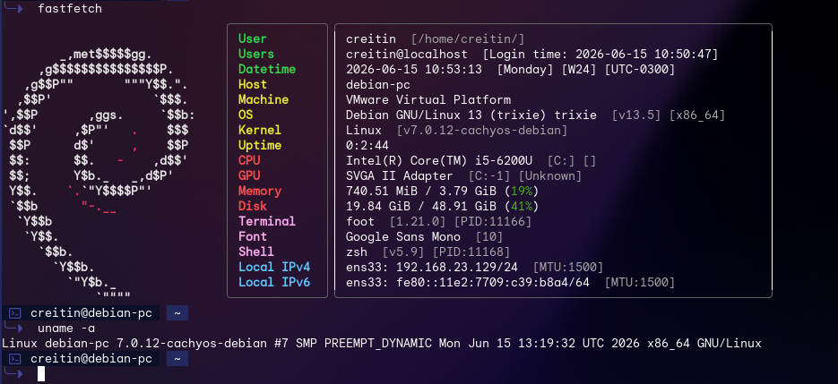

<div style="border: 3px solid #6effaf; border-radius: 5px; overflow: hidden; display: inline-block;">
  
</div>

# CachyOS Debian 内核构建器

[English README](README.md) | 中文文档

把选定的 [CachyOS](https://github.com/CachyOS/linux-cachyos) 内核变体，构建成可安装的 Debian `.deb` 包。

面向 Debian 系系统：想用 CachyOS 风格内核，又不想在本机长期维护完整编译环境。桌面和服务器都可以用。

本项目与 CachyOS 官方无隶属关系。构建时从上游 CachyOS 仓库拉取内核源码与打包元数据。

主构建路径：**CNB 云原生构建**（32 vCPU），由 GitHub Actions 负责触发、状态和产物回收。GitHub/Blacksmith 作为备用。

基于 [Deadly-Signal/cachy-kernel-debian](https://github.com/Deadly-Signal/cachy-kernel-debian)。

## 快速开始

### 安装已有构建

1. 打开 [Releases](../../releases)
2. 下载对应的 `linux-image-*.deb` 和 `linux-headers-*.deb`
3. 一般装普通 image/headers 即可；除非要做崩溃调试，否则不要装 `*-dbg`
4. 安装：

```bash
sudo apt install ./linux-image-*.deb ./linux-headers-*.deb
sudo update-grub
sudo reboot
uname -r
```

如果 Release 里还有 `linux-libc-dev_*.deb`，需要匹配的用户态内核头文件时可以一并安装。

请保留一个已知可用的发行版自带内核，方便引导回退。

### 构建新包

1. 打开 **Actions**
2. 运行 **Build CachyOS Kernel on CNB**
3. 按需选择参数
4. 成功后从这里下载：
   - GitHub **Release**（`publish_release=true` 时）
   - 本次工作流 **Artifacts**（保留 14 天）

## 工作流一览

| 工作流 | 作用 | 触发方式 |
| --- | --- | --- |
| **Build CachyOS Kernel on CNB** | 主构建入口，每次只构建一个组合 | 手动 |
| **Check and build aggressive x64v2 on CNB** | 检查最新 `linux-cachyos-rc` + `generic_v2`，没有对应 Release 才构建 | 定时 + 手动 |
| **Build Custom CachyOS Kernel Debian Package** | GitHub/Blacksmith 单组合备用构建 | 手动 |
| **Reusable CachyOS Kernel Build** | 给备用构建调用的内部复用工作流 | 不面向用户 |

## 构建内容

单次构建大致流程：

1. 克隆 [CachyOS/linux-cachyos](https://github.com/CachyOS/linux-cachyos) 中当前所选的官方变体
2. 下载该变体的精确源码和补丁列表，并执行上游 `PKGBUILD` 的 `prepare()`
3. 执行 `olddefconfig`，使上游新加入的 Kconfig 项使用当次上游默认值
4. 只叠加包名命名空间、所选 CPU 基线（`x64v1` / `x64v2` / `x64v3`），以及可选的 debug 包精简
5. 用 `bindeb-pkg` 打 Debian 包
6. 做包校验，并可在 QEMU 中冒烟启动
7. 发布产物

常见产物：

- `linux-image-*.deb`
- `linux-headers-*.deb`
- 若生成则包含 `linux-libc-dev_*.deb`
- `BUILD-MANIFEST.txt`（版本信息与 SHA256）

默认跳过 `linux-image-*-dbg`：体积很大，多数场景用不到。

### 配置归属

| 层级 | 来源 |
| --- | --- |
| 内核配置、KVM/VFIO、驱动、补丁队列、调度器、LTO/编译器、HZ、tick、抢占、THP、O3、governor、BBR3、KCFI | 所选上游变体（`upstream-default`）或手动调度器覆盖 |
| 本地配置增量 | 包的 `LOCALVERSION`、所选 x86-64 CPU 基线，以及 `skip_debug_packages=true` 时关闭调试信息 |
| CPU 基线标识 | `generic` / `generic_v2` / `generic_v3` → 显示为 `x64v1` / `x64v2` / `x64v3` |

`upstream-default` 表示不覆盖该变体自己的默认调度器。对 `linux-cachyos-rc` 来说，就是官方 RC 默认 profile。

Stable 与 RC 的差异来自上游官方 profile 不同。`BUILD-MANIFEST.txt` 会记录实际使用的 CachyOS 打包提交、配置校验值、下载补丁数和最终配置校验值。

因此上游新增的 Kconfig 项、KVM/VFIO 改动、驱动和补丁队列，会在下一次构建直接进入，不需要在本仓库维护完整 `.config`。CachyOS 的 ZFS、NVIDIA Open、r8125 等 Arch 专用附属包不会被悄悄丢弃：如果上游默认启用了其中一个，这个 Debian 构建器会明确失败，因为它需要独立的 Debian 打包适配。普通 Debian 的 ZFS 请配合生成的 headers 安装发行版的 ZFS DKMS 包；PVE 项目则使用 PVE 自己的 OpenZFS 集成。

## CPU 基线

| 标识 | `cpu_target` | 含义 |
| --- | --- | --- |
| `x64v1` | `generic` | 兼容性最广 |
| `x64v2` | `generic_v2` | 需要 x86-64-v2：SSSE3、SSE4.1/4.2、POPCNT、CX16、LAHF/SAHF 等 |
| `x64v3` | `generic_v3` | 需要 x86-64-v3：AVX2、BMI1/2、FMA、MOVBE、F16C 等 |

`x64vN` 是最低指令集等级，不是 CPU 型号名。安装前先在目标机器检查：

```bash
lscpu
```

CI 不会使用 `-march=native`，否则会按云构建机 CPU 优化，而不是按你的机器。

例如：Ivy Bridge 级别客户机（如 Xeon E5-2696 v2）通常适合 **`x64v2`**，不适合 `x64v3`。

## 手动 CNB 构建参数

| 参数 | 默认 | 说明 |
| --- | --- | --- |
| `kernel_variant` | `linux-cachyos-rc` | 官方打包变体 |
| `cpu_target` | `generic_v2` | `generic` / `generic_v2` / `generic_v3` |
| `cpu_scheduler` | `upstream-default` | 也可覆盖为 `cachyos`、`eevdf`、`bore`、`bmq`、`hardened`、`rt`、`rt-bore` |
| `run_qemu_smoke_test` | `true` | QEMU 最小启动测试 |
| `publish_release` | `true` | 发布正式 GitHub Release |
| `release_tag` | 空 | 留空自动生成，如 `cachyos-debian-aggressive-7.2.rc3-2-x64v2` |
| `mark_latest` | `false` | 是否标为 latest |
| `skip_debug_packages` | `true` | 跳过巨大的 `*-dbg` 包 |

## 自动激进版 x64v2 检查

工作流：**Check and build aggressive x64v2 on CNB**

针对某一个常用组合的可选自动化：

- 变体：`linux-cachyos-rc`
- CPU：`generic_v2`（`x64v2`）
- 调度器：`upstream-default`
- 发布 Release：开启
- 默认跳过 `-dbg`

逻辑：

1. 每天定时检查一次：**UTC 00:00（北京时间 08:00）**
2. 拉取上游 RC 打包元数据
3. 计算应存在的 Release 标签
4. 只有 Release 不存在时才启动 CNB
5. 手动运行该工作流时，会立刻做同样的检查

如果仓库策略导致无法写入 Actions 变量 `CNB_AGGRESSIVE_V2_LAST_CHECK`，工作流只会警告并继续。真正的构建开关始终是“对应 Release 是否已存在”。

如果 Release 已存在但仍想重编，请直接运行 **Build CachyOS Kernel on CNB**。

## 产物：Release 与 Artifacts

CNB 成功后会有：

1. **GitHub Release**（`publish_release=true` 时）
2. 同一 workflow run 下的 **Actions Artifacts**（保留 14 天）

Artifacts 生成过程：

1. CNB 先创建一个临时 draft：`cnb-run-<github_run_id>`
2. GitHub 任务下载该 draft
3. 上传到 workflow Artifacts
4. 尽力删除临时 draft

请从正式 Release 或 Artifacts 页面下载。如果中途瞥见 `cnb-run-*` draft，忽略即可，跑完会删。

## 安装与回退

```bash
sudo apt install ./linux-image-*.deb ./linux-headers-*.deb
sudo update-grub
sudo reboot
uname -r
```

安装前先看 `BUILD-MANIFEST.txt` 里的版本、CPU 基线、调度器和校验和。

务必保留一个可用的发行版自带内核作为引导回退项。

## Fork 后如何接入 CNB

默认 CNB 仓库路径：

```text
<你的 GitHub 用户或组织>/cachy-kernel-debian
```

如果实际路径不同，用 Actions 变量 `CNB_REPO` 覆盖。

步骤：

1. 在 CNB 创建空仓库
2. 创建可写仓库、并带 `repo-cnb-trigger:rw` 的 CNB 访问令牌
3. 在 GitHub：**Settings → Secrets and variables → Actions**
   - Secret：`CNB_TOKEN` = CNB 令牌
   - 可选 Variable：`CNB_REPO` = `组织/仓库`
4. 确保 GitHub Actions 可写仓库内容（本工作流已声明 `contents: write`）
5. 运行 **Build CachyOS Kernel on CNB**

### 权限边界

| 项目 | 位置 |
| --- | --- |
| `CNB_TOKEN` | 只存在于 GitHub Actions Secret |
| 临时 `GITHUB_TOKEN` | 仅注入当次 CNB 任务，用于 Release/Artifact 上传，任务结束失效 |
| CNB 中的永久 GitHub 凭证 | 不保存 |

CNB 没有向 GitHub 回推 commit 的权限。GitHub 在触发前会把当前构建对应的准确 commit 同步到 CNB。

参考：

- [StartBuild API](https://api.cnb.cool/#/operations/StartBuild)
- [CNB 构建节点](https://docs.cnb.cool/zh/build/build-node.html)

## GitHub / Blacksmith 备用路径

CNB 不可用时，使用 **Build Custom CachyOS Kernel Debian Package**。

- 每次只构建一个组合
- 可选 Blacksmith 或 `ubuntu-24.04`
- 上传 workflow Artifacts
- 可选发布 Release

## 兼容说明

上游 prepare 之后，本仓库会叠加 Debian/KVM 友好的兼容配置，例如：

- initramfs 启动
- 可加载模块
- VirtIO / KVM / 常见块设备和网卡
- 常见文件系统与网络特性（含 WireGuard）

能不能在你机器上顺利用，仍取决于硬件、固件、引导器、Secure Boot、DKMS 和发行版版本。

VirtIO-GPU 不是必须；无桌面客户机通常不用开。

## 校验

发布前会：

- 检查 image/headers 包是否存在
- 检查 `.deb` 元数据
- 运行 `lintian`（对自定义内核的常见警告做合理放行）
- 检查 `vmlinuz-*`、模块与 headers 内容
- 可选 QEMU 启动到串口成功标记

自定义内核出现包名过长、headers 辅助二进制依赖等 `W:` 警告是常见现象。

## 仓库结构

```text
.cnb.yml
.cnb/Dockerfile
.cnb/build-kernel.sh
.github/workflows/build-cachyos-kernel-cnb.yml
.github/workflows/build-cachyos-kernel-cnb-aggressive-v2.yml
.github/workflows/build-cachyos-kernel-custom.yml
.github/workflows/reusable-cachyos-kernel-build.yml
README.md
README.zh-CN.md
```

## 重要说明

- 能否正常使用取决于硬件、固件、引导器、Secure Boot、DKMS 与发行版版本
- Secure Boot 环境可能需要签名或调整策略
- 不构建 NVIDIA DKMS 等树外模块
- 安装 `x64vN` 包前务必确认机器指令集是否足够
- 产物是普通 Debian 内核包，不是 Proxmox 官方风格内核，也不是 Ubuntu HWE 套件

## 相关链接

- [English README](README.md)
- [Deadly-Signal/cachy-kernel-debian](https://github.com/Deadly-Signal/cachy-kernel-debian)
- [CachyOS 打包仓库](https://github.com/CachyOS/linux-cachyos)
- [CachyOS 内核源码发布](https://github.com/CachyOS/linux/releases)
- [CNB StartBuild API](https://api.cnb.cool/#/operations/StartBuild)
